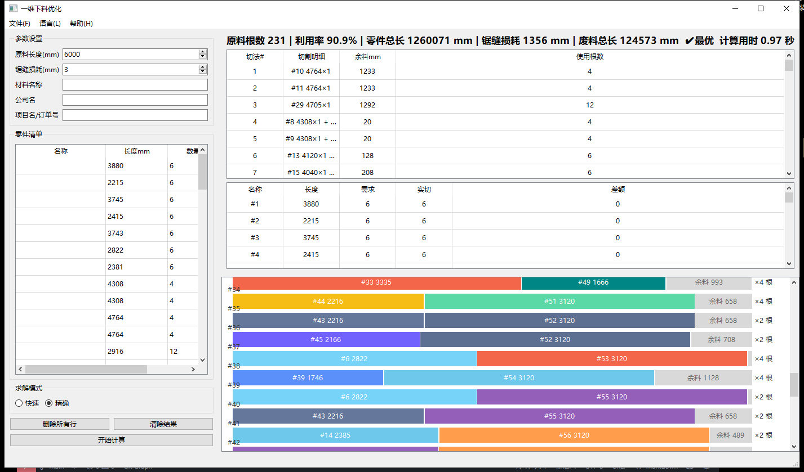

<div align="center">


# 一维下料优化 · 1D Cutting Optimizer

**面向钢管 / 型钢工厂的一维切割下料优化工具**
**A 1D cutting-stock optimizer for steel tubes and profiles**

[]()
[]()
[]()
[](LICENSE)
[]()

**[English](#english) | [中文](#中文) | [项目主页 / Project Page](https://YOUR-NAME.github.io/cutting/)**



</div>

---

<a id="中文"></a>
## 🇨🇳 中文

### 简介

工厂生产中，需要将定长的原材料（钢管、槽钢、角钢等型钢）切割成不同长度的零件。
人工排料费时费力且浪费严重。本软件通过优化算法自动计算切割方案，**最大限度减少废料、
提高材料利用率**，并将结果以示意图和报表形式输出，可直接打印交给车间执行。

专为**非技术人员**（工厂生产管理人员）设计：双击打开 → 录入或导入零件清单 → 一键计算 → 导出方案。

### ✨ 功能特性

- **双模式求解引擎**
  - ⚡ **快速模式**：启发式算法，千级零件秒级出结果，适合日常使用
  - 🎯 **精确模式**：基于 OR-Tools CP-SAT 数学规划，求得**全局最优解**（✔最优标记）；
    超过 30 秒自动终止并建议改用快速模式
  - 计算时按钮实时显示「正在计算… N 秒」，完成后统计栏显示总用时
- **数据输入**
  - 表格手工录入零件（长度 + 数量），支持增删改、列宽拖拽
  - Excel 一键导入（提供模板下载，自动校验数据并提示错误行）
  - 原料长度、锯缝损耗、材料名称参数化设置
- **结果展示**
  - 按比例切割示意图：零件段标注长度，余料灰色显示，相同切法合并「×N 根」
  - 方案汇总表 + 零件明细核对表（需求 vs 实际切出）
  - 统计栏：原料根数 / 利用率 % / 零件总长 / 锯缝损耗 / 废料总长
- **报表输出**
  - 导出 Excel（方案汇总 + 零件核对 + **切割示意图**）
  - 导出 PDF 报告，可直接打印
- **国际化**：界面支持中文 / English 双语切换

### 🚀 快速开始

#### 方式一：直接运行（推荐给使用者）

从 [Releases](../../releases) 下载 `一维下料优化.exe`，双击即可运行，无需安装 Python。

#### 方式二：源码运行（开发者）

```bash
# 需要 Python >= 3.12 与 uv (https://docs.astral.sh/uv/)
git clone https://github.com/YOUR-NAME/cutting.git
cd cutting

# 安装依赖（uv 会自动创建虚拟环境）
uv sync

# 运行
uv run python main.py
```

### 📖 使用说明

1. **设置参数**：填写原料长度（mm）、锯缝损耗（mm）、材料名称
2. **录入零件**：手工逐行添加，或「文件 → 导入 Excel…」批量导入
3. **选择模式**：快速（默认）或精确
4. **开始计算**：查看统计栏、切割示意图与方案表格
5. **导出**：「文件 → 导出 Excel… / 导出 PDF…」，或直接打印

### 🛠 技术栈

| 层 | 技术 |
|---|---|
| GUI | PySide6 (Qt 6) |
| 精确求解 | Google OR-Tools CP-SAT |
| Excel | openpyxl |
| PDF / 示意图 | reportlab + pillow |
| 工程管理 | uv，pytest（144 项测试），mypy，ruff |
| 打包 | PyInstaller（单文件 exe） |

### 📁 项目结构

```
├── main.py          # 入口
├── app/             # 控制器、后台求解线程
├── core/            # 求解器（精确/启发式）、数据模型、统计
├── ui/              # 主窗口、输入面板、结果面板、图表
├── fileio/          # Excel/PDF 导入导出
├── i18n/            # 中英文翻译
├── tests/           # pytest 测试（144 项）
├── doc/             # 需求与设计文档
└── docs/            # GitHub Pages 站点
```

### 🧪 测试

```bash
uv run pytest        # 144 passed
```

### 📄 许可证

[MIT License](LICENSE)

---

<a id="english"></a>
## 🇬🇧 English

### Introduction

In factories, fixed-length raw stock (steel tubes, channels, angles and other profiles)
must be cut into parts of various lengths. Manual nesting is slow and wasteful.
This tool computes cutting plans automatically with optimization algorithms,
**minimizing waste and maximizing material utilization**, and outputs the results
as diagrams and reports that can be printed and handed directly to the workshop.

Designed for **non-technical users** (production managers): double-click to launch →
enter or import the part list → one click to optimize → export the plan.

### ✨ Features

- **Dual solver engines**
  - ⚡ **Fast mode**: heuristic solver — thousands of parts solved in seconds
  - 🎯 **Exact mode**: mathematical programming powered by OR-Tools CP-SAT, producing
    a **provably optimal** solution (✔Optimal badge); automatically stops after 30 s
    and suggests switching to fast mode
  - The run button shows a live "Optimizing… N s" stopwatch; total elapsed time
    appears in the statistics bar when finished
- **Data input**
  - Manual table entry (part length + quantity) with add/edit/delete rows and
    resizable columns
  - One-click Excel import (template download included, with per-row validation)
  - Configurable stock length, kerf loss and material name
- **Result visualization**
  - Proportional cutting diagrams: part segments labeled with lengths, remnant
    shown in gray, identical patterns grouped as "×N"
  - Plan summary table + part verification table (demand vs. actually cut)
  - Statistics bar: stock bars used / utilization % / total part length /
    kerf loss / total waste
- **Report output**
  - Excel export (plan summary + part verification + **cutting diagrams**)
  - PDF report export, ready to print
- **i18n**: UI available in Chinese and English

### 🚀 Quick Start

#### Option 1: Run the binary (for end users)

Download `一维下料优化.exe` from [Releases](../../releases) and double-click —
no Python installation required.

#### Option 2: Run from source (developers)

```bash
# Requires Python >= 3.12 and uv (https://docs.astral.sh/uv/)
git clone https://github.com/YOUR-NAME/cutting.git
cd cutting

uv sync                # install dependencies (uv creates the venv)
uv run python main.py  # launch
```

### 📖 Usage

1. **Set parameters**: stock length (mm), kerf loss (mm), material name
2. **Enter parts**: add rows manually, or *File → Import Excel…* for batch import
3. **Pick a mode**: Fast (default) or Exact
4. **Optimize**: review the statistics bar, cutting diagrams and plan tables
5. **Export**: *File → Export Excel… / Export PDF…*, or print directly

### 🛠 Tech Stack

| Layer | Technology |
|---|---|
| GUI | PySide6 (Qt 6) |
| Exact solver | Google OR-Tools CP-SAT |
| Excel | openpyxl |
| PDF / diagrams | reportlab + pillow |
| Tooling | uv, pytest (144 tests), mypy, ruff |
| Packaging | PyInstaller (single-file exe) |

### 🧪 Testing

```bash
uv run pytest        # 144 passed
```

### 📄 License

[MIT License](LICENSE)
